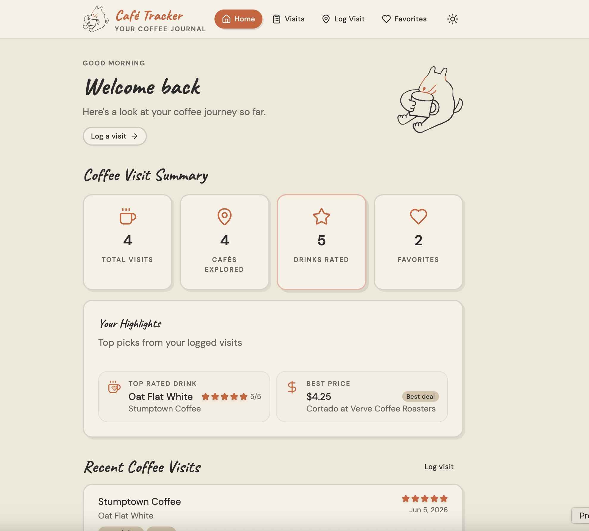
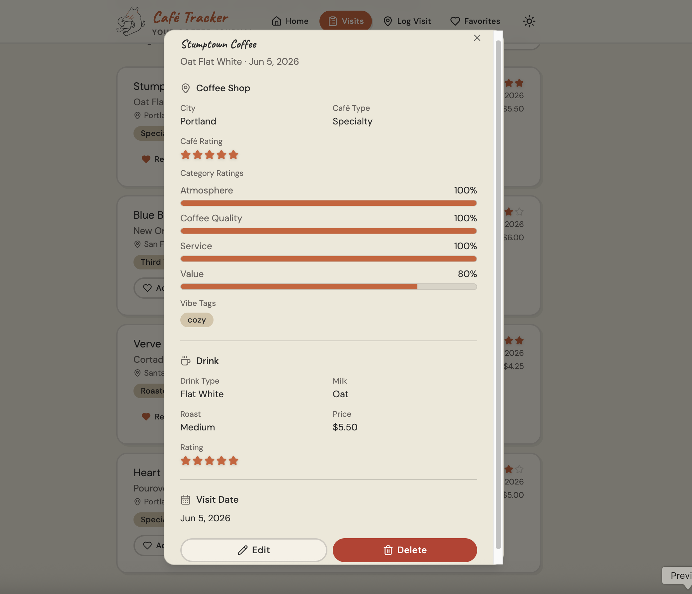
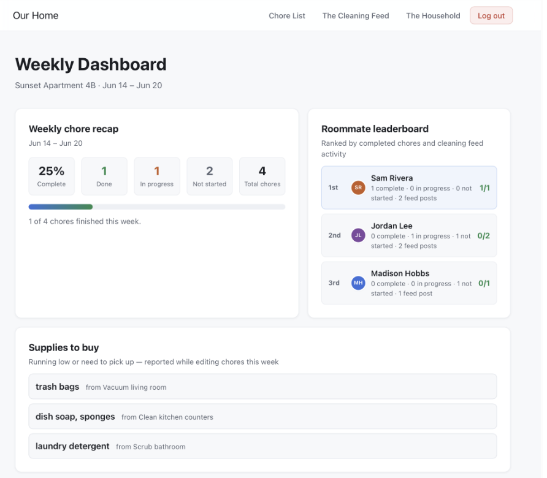
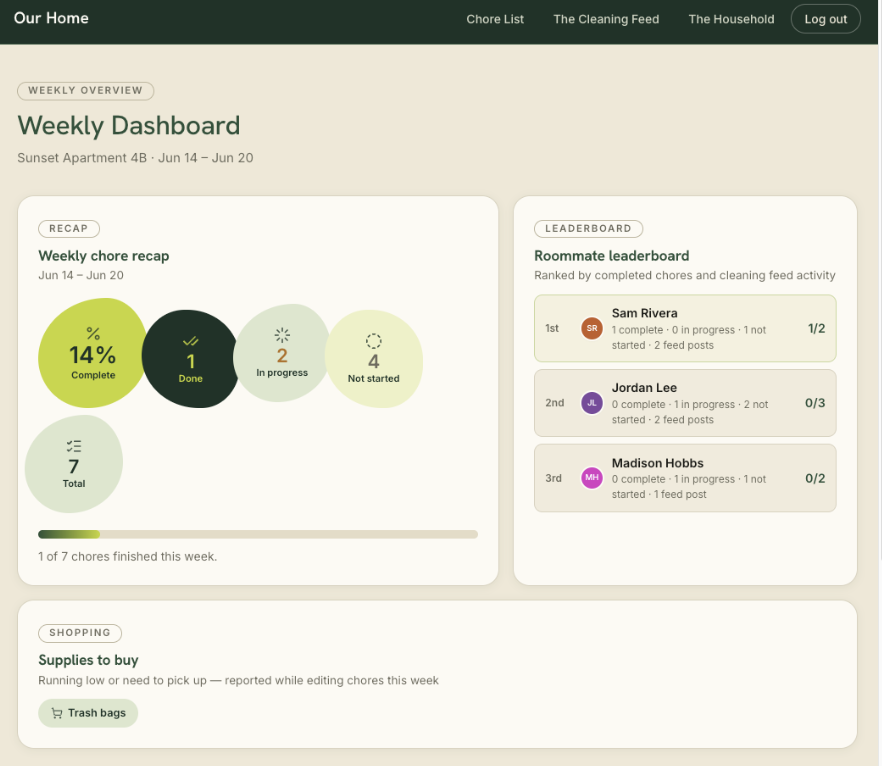
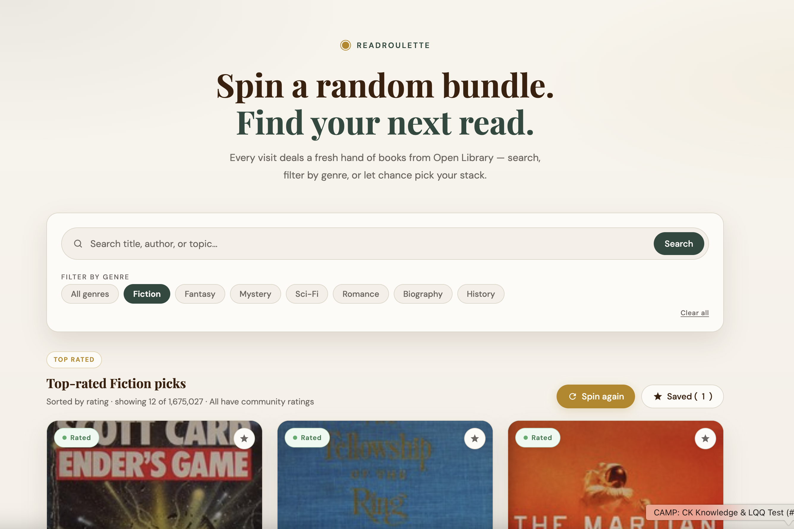
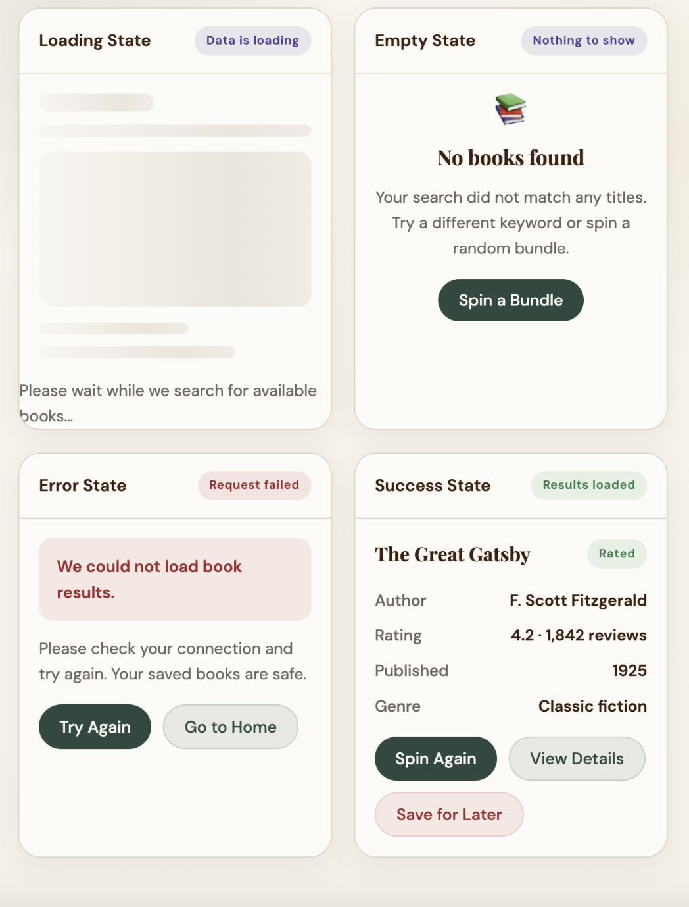

<!--
This is an AGGREGATE case study: one page covering several mini web apps built over the
semester (e.g. BudgetIsland, ChoreTracker, + others). Fill in the sections below.
For each app, replace the placeholder text and add screenshots to AIWebApps/assets/.
Reference images in any section like:  
Add a pull quote in any section like:   > A short, punchy line that captures the idea.
Delete these comments when you're done. Tell me when it's ready and I'll generate the page.
-->

## Overview

This collection is a record of five web apps I designed and built this semester using AI assisted development tools, each one a small, self contained problem used to practice a different piece of the same skill: going from an idea to a working, deployed application with AI as a genuine build partner. The throughline across every app is the same repeatable method, plan first, design a system, prompt deliberately, wire in real logic, then ship. By the end of the semester that method took me from a blank prompt to a live, functioning app in about a week.

## Problem

The brief for the semester was to learn how to build functional web apps quickly using AI assisted tools, without relying on a traditional engineering background to get there. A single large project would not have taught that skill well. One project only tests one set of decisions once. A series of small, varied apps, a budgeting tool, a tracker, a household dashboard, a book discovery tool, forced me to reapply the same method in a fresh context every time, which is what actually builds fluency instead of memorizing one project's quirks.

## Approach

The same method carried across every app, even as the apps themselves got more ambitious:

- **Plan the flows first.** Before writing a single prompt, I defined the core user tasks and mapped the user flow and site structure for the app. Skipping this step early in the semester was the clearest cause of an app drifting structurally as it grew.
- **Define a small design system.** Starting in Week 4, every app got a lightweight component and token set, colors, type, spacing, before I asked for more screens. This is what kept an app visually consistent as I added features, instead of every new screen introducing its own styling.
- **Prompt in Plan Mode, then switch to Agent Mode.** I used Cursor's Plan Mode to review what the AI intended to build against my plan file before letting it execute in Agent Mode. Reviewing the plan first caught misunderstandings before they became code.
- **Review before executing.** Every generated change got a read through before I accepted it, especially once I started wiring in real data and logic.
- **Wire real data and logic.** Once the structure and system were solid, I connected real data, a public API, database tables, or stored state, and built out the loading, empty, success, and error states that a real user would actually hit.
- **Commit and deploy.** Every app ended the same way: committed with meaningful history where version control was in place, and published live on Netlify.

## The Apps

### Budget Island

A spending tracker with a gamified twist. Set a monthly limit, log spending day to day, and a small visual island grows when you have a quiet, low spend day. All data stays on device. This was my first app of the semester, built with a single tool and no upfront planning, and the most interesting lesson was seeing how quickly a project without a plan starts making its own inconsistent decisions as it grows.

### Coffee Tracker

Coffee Tracker logs every coffee run, the drink, the cafe, and the price, then plots each visit on a map so a running history of where you've been builds itself automatically. Favorite cafes get saved separately, making it easy to see patterns in where and what you actually order over time.

### Chore Tracker

A household chore dashboard for a shared home. Weekly task cards show the assignee, due date, and status, with room to attach a completion photo. I built this app twice. The first version came out of a two tool pipeline, starting the first user task in Figma Make, then downloading that code into Cursor to finish the rest. The second version was a full rebuild on top of a formal design system, following a six step process of analyzing a moodboard, defining principles, building design tokens, defining components, and writing it all into a DESIGN.md file. Rebuilding the same app instead of starting fresh made the value of a design system undeniable, the second version stayed consistent in a way the first one never quite did.

Before and after: the AI's default design versus a custom design system built from an inspiration board and documented in DESIGN.md.

### Read Roulette

A book discovery tool that pulls live from the Open Library public API. Search by title, filter by genre, or spin a random bundle of books, then save titles for later. This app was where I built out real data states for the first time, loading, empty, success, and error, rather than assuming the happy path is the only one a user will see.

## Process

Each app picked up where the last one left off. Budget Island taught me the basics of prompting with a single tool and no plan. Coffee Tracker added the discipline of mapping user flows and site structure before writing a single prompt. Chore Tracker's first version introduced a two tool workflow, moving between Figma Make and Cursor, and its second version added a real design system, which is the point where my apps stopped looking like separate one off experiments and started looking like they came from the same hand. Read Roulette added live data and the states that come with it. The clearest trade off across the semester was speed against structure, moving fast without a plan felt faster in the moment, but it cost more time later fixing inconsistency than planning would have taken up front.

## Outcome

Four small apps and one larger course project, all deployed and live, each demonstrating a distinct piece of the AI assisted build pipeline: prompting fundamentals, user flow driven planning, a Figma Make to Cursor workflow, formal design systems, live API integration and data states, and version controlled deployment. Taken together, the body of work shows I can carry a product from an idea through a working, systemized, deployed application, using AI as the primary build tool rather than a drafting aid.

## Reflection

The biggest thing I learned is that a design system is not a finishing touch, it is infrastructure that needs to exist before a project scales past its first few screens. Rebuilding Chore Tracker in Week 4 proved that in a way reading about design systems never could. If I started the semester over, I would build a lightweight design system on day one, even for something as small as Budget Island. More broadly, this semester changed how I see my own role. I came in thinking of myself as a researcher and service designer who hands off direction to engineers. I am leaving it able to carry a product from research and user flows through to a deployed, working application, which changes the kind of conversation I can have with an engineering team from the very start.